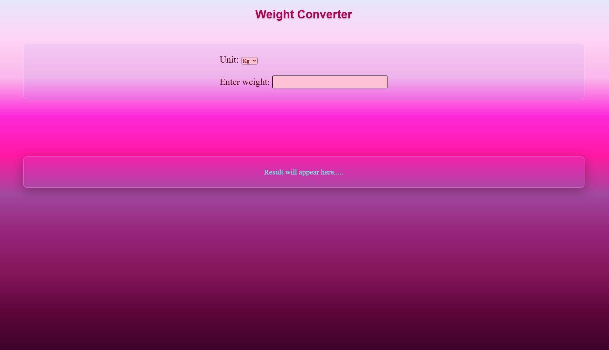

# Glassmorphism Weight Converter 🏋️‍♂️

A modern, real-time weight conversion tool built with Vanilla JavaScript and advanced CSS. This project focuses on a "Glassmorphism" aesthetic, providing a sleek user interface for instant weight calculations.

  

## 🚀 Features
- **Real-time Conversion:** Instantly converts between Kilograms and Pounds as you type.
- **Interactive UI:** Automatically recalculates when the user switches units in the dropdown menu.
- **Glassmorphism Design:** Modern frosted-glass effect achieved using CSS `backdrop-filter` and transparent `rgba` layers.
- **Smooth Transitions:** Integrated CSS animations for interactive hover states and floating effects.

## 🛠️ Built With
- **HTML5:** For semantic input structures.
- **CSS3:** Featuring linear gradients, Flexbox layout, and glassmorphism styling.
- **JavaScript (Vanilla):** Functional programming for DOM manipulation and mathematical logic.

## 🧠 Key Learnings
- **Event Handling:** Utilized `.oninput` and `.onchange` to ensure the UI stays synchronized with user data.
- **DOM Manipulation:** Managing data flow between HTML input elements and text display areas.
- **CSS Hierarchy:** Creating depth and elevation through the use of layered box-shadows and blur filters.

## 📂 Installation & Usage
1. Clone the repository.
2. Open `index.html` in any modern web browser.
3. Enter a value in the input field and toggle the dropdown to see instant results.

---
*Developed by a 2nd-year CS Student as a project to master JavaScript fundamentals and modern UI design.*
